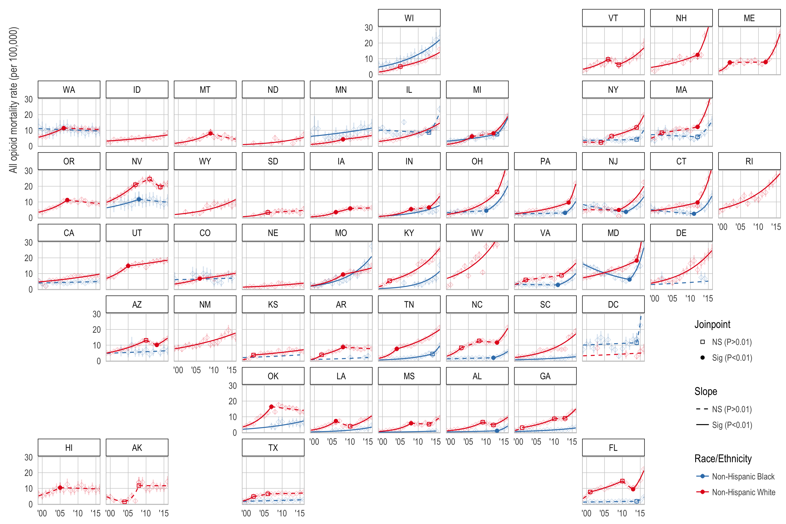

<!-- README.md is generated from README.Rmd. Please edit that file -->

# `opioid_hotspots`

[See the [interactive results explorer here](http://shiny.demog.berkeley.edu/mkiang/opioid_hotspots/results_explorer/).]

```{r echo=FALSE}
## A key plot

```

# Introduction

Code for our paper and talk "Geographic Variation in Opioid Mortality by Race/Ethnicity in the United States, 1999-2016: Identifying epidemic hotspots". This paper was presented at Population Association of America ([PAA](https://paa.confex.com/paa/2018/webprogrampreliminary/Paper22264.html)) Annual Meeting 2018 in Denver, CO by Matt, and European Population Conference ([EPC](https://eaps.confex.com/eaps/2018/meetingapp.cgi/Paper/2208)) 2018 in Brussels, Belgium by Monica. We used [multiple cause of death data](https://www.cdc.gov/nchs/nvss/mortality_public_use_data.htm) to examine geographical and racial/ethnic variation in opioid mortality, by opioid type, over time. It's an extension of our [previous work](https://github.com/mkiang/opioid_trends) published ahead-of-print in [*Epidemiology*](https://journals.lww.com/epidem/Abstract/publishahead/Trends_in_Black_and_White_Opioid_Mortality_in_the.98701.aspx) in May 2018.

The full citation is:

>  Geographic Variation in Opioid Mortality by Race/Ethnicity in the United States, 1999-2016: Identifying epidemic hotspots. Kiang MV, Alexander MJ, Zhang Z, and Chen JT. Presented at PAA 2018: Denver, CO. April, 2018.

If you'd like a copy of the slides, [they are in the `rmds` folder](https://github.com/mkiang/opioid_hotspots/blob/master/rmds/).

## About reproducibility 

Due to limitations on sharing the restricted-access data, this pipeline is not fully reproducible. When possible, we provide raw data as well as model estimates. In the cases where observations have fewer than 10 deaths, we suppress the rate (as well as the model MSE and SSE), in accordance with the NCHS data use agreement.

## Interactive results explorer 

To help explore our results, we created an [interactive results explorer](http://shiny.demog.berkeley.edu/mkiang/opioid_hotspots/results_explorer/), which provides a national overview, state-specific results, categorization of epidemic hotspots, and further exploration of our paper results. This Shiny app is generously hosted by the [Department of Demography at UC Berkeley](http://www.demog.berkeley.edu/). 

You can also run this Shiny app locally by cloning the repository and running the app from `./results_explorer/app.R`.

## Issues
Please submit issues [via Github](https://github.com/mkiang/opioid_hotspots/issues).

# Requirements
## Restricted-access data

Unfortunately, for years after 2004, the [multiple cause of death](https://www.cdc.gov/nchs/nvss/mortality_public_use_data.htm) data do not include geographic identifiers so state-level analysis using the public-access data is not possible. To get restricted data, you must apply through [NAPHSIS](https://www.naphsis.org/). After ingesting and cleaning the restricted access data, we have these files (not located on this repository):

```{r}
print(list.files(config::get()$mcod_files, full.names = TRUE))
```

Our amendment for access to the 2016 file is still under review. Thus, we supplement our restricted-access 1999-2015 data with the public-access 2016 data available through [CDC WONDER](https://wonder.cdc.gov/).

## Software

All analyses are conducted using [`R`](https://cran.r-project.org/), and the NCI's [Joinpoint Regression Program](https://surveillance.cancer.gov/joinpoint/). In addition, we highly recommend the use of [RStudio](https://www.rstudio.com/products/rstudio/download/) when running `R`.

## `R` Packages
To run this code, you'll need the following `R` packages from CRAN:

For data manipulation: 

- `tidyverse`
- `doParallel`
- `foreach`
- `knitr`
- `config`
- `rmarkdown`
- `yaml`
- `digest`

For plotting: 

- `ggrepel` 
- `gridExtra` 
- `cowplot` 
- `viridis` 

In addition, you'll need these packages which should be installed via Github and not CRAN:

- Our package for working with multiple cause of death data, [`narcan`](https://github.com/mkiang/narcan).
- The [`geofacet`](https://github.com/hafen/geofacet) package for plotting state results on an approximation of a map.
- My fork of the [`statebins`](https://github.com/hrbrmstr/statebins) package for plotting the US-shaped choropleth.

These packages can be installed using the script or running the following commands:

```{r, eval=FALSE}
devtools::install_github('mkiang/narcan')
devtools::install_github('hafen/geofacet')
devtools::install_github('mkiang/statebins')
```

# Analysis pipeline
## Configuation file

The `./config.yml` file contains several global parameters for the analysis pipeline in JSON format. Specifically:

  - `start_year`: Starting year of the restricted-access data
  - `end_year`: Last year of restricted access data
  - `working_data`: Where to save working (i.e., not private, not restricted) data
  - `private_data`: Where to save private (i.e., contains cells < 10 observations) data
  - `mcod_files`: Path to the restricted-access MCOD files
  - `zero_rate`: Log-linear models require positive rates. If zero, use this rate. 
  - `plot_dir`: Where to save plots
  - `proc_in_parallel`: When `true`, perform calculations in parallel
  - `keep_working_data`: Keep intermediate files?
  - `force_process`: When `true`, overwrite existing files
  - `num_cores`: Number of cores to use (null = 1/2 cores)

Typically, a user should not need to change any of these parameters; however, on a computer with sufficient RAM, setting `proc_in_parallel` to `true` should result in significant (linear) speedup. Be warned that this may result in significant RAM usage (~16 GB of RAM for four processes) and is not recommended for typical computing environments. Downloading and cleaning the data on a single processor takes somewhere in the order of a few hours.


## Code files
The analysis pipeline is divided into three parts. 

- **Part 0**: Process raw restricted-access files and create a population dataframe. Note, you must specify the location of the restricted-access files in `./config.yml`.
- **Part 1**: Create a working dataframe of deaths and population counts for every state/year/opioid type/race/ethnicity of interest. 
- **Part 2**: Calculate age-standardized rates at the state and national levels. Reshape these rates for ingestion into the Joinpoint Regression Program.
- **Part 3**: Run analyses on the joinpoint regression program (excluded from this repo).
- **Part 4**: Create plots.

Each part has discrete steps and is described in detail below.

### Part 0: Getting and processing data
- **Step 1**: `./code/00a_process_raw_data.R`: Loops through the restricted-access files (you must provide the path to these files in the `config.yml` file) and subsets to only the columns we will need for analysis. Does additional data cleaning using the `narcan` package.
    - Inputs: Restricted-access MCOD files (17 files)
    - Outputs: `./data_private/proc_XXXX.RDS` (17 files)
- **Step 2**: `./code/00b_create_pop_data.R`: Downloads, munges, and reshapes the US Census Bridged-Race Population Estimates so we can calculate age-specific and age-standardized rates.
    - Inputs: Downloads US Census Pop files (4 files)
    - Outputs: `./data/pop_est_collapsed_long.RDS`
    
### Part 1: Creating a working dataframe
- **Step 1**: `./code/01a_flag_opioid_deaths.R`: Loops through the files we've already processed and flags the opioid deaths (by opioid type) using `narcan`. Opioid deaths are defined according to [the ISW7 definitions](http://c.ymcdn.com/sites/www.cste.org/resource/resmgr/injury/isw7.pdf). 
    - Inputs: Restricted-access MCOD files (17 files)
    - Outputs: `./data_private/state_opioid_deaths.RDS` 
- **Step 2**: `./code/01b_create_working_df.R`: Creates a single working dataframe where every row is a year/state/age/race observation and columns include population, state information, standard population, number of total deaths, opioid deaths, etc.
    - Inputs: 
        - `./data_private/state_opioid_deaths.RDS` 
        - `./data/pop_est_collapsed_long.RDS`
    - Outputs: `./data_private/state_working_data.RDS`

### Part 2: Calculate age-standardized rates and reshape for joinpoint
- **Step 1**: `./code/02a_calculate_state_rates.R`: For every year/state/race/opioid type, calculate the age-standardized rate and a dataframe with death counts below 10 so we know which observations to suppress in the public file.
    - Inputs: `./data_private/state_working_data.RDS`
    - Outputs: 
        - `./data/total_deaths_suppressed.RDS` 
        - `./data/state_age_std_rates.RDS`
- **Step 2**: `./code/02b_cdc_wonder_2016_rates.R`: Reads in the public-use data and turns it into the same format as the restricted-use data so we can just bind the rows.
    - Inputs: `./data/cdc_wonder/*` (8 files)
    - Outputs: `./data/cdc_wonder_2016.RDS`
- **Step 3**: `./code/02c_reshape_for_joinpoint.R`: Combines the public and private data and reshapes into a form the NCI Joinpoint Regression Program can work with. Then outputs to a file the JRP can read. (Note, joinpoint files contain observations with fewer than 10 deaths so they are not on the online repository.)
    - Inputs: 
        - `./data_private/state_age_std_rates.RDS`
        - `./data/cdc_wonder_2016.RDS`
        - `./data/total_deaths_suppressed.RDS`
    - Outputs: `./joinpoint_analyses/opioids_by_type_2016.csv`

### Part 3: Performing joinpoint regressions

Unlike [previous projects](https://github.com/mkiang/opioid_trends) that used public-access data, we cannot share the joinpoint results or session files directly. We ran a standard joinpoint session with the "by-variables" set as abbrev/race/opioid type. In addition, we set the model fit to be based on 10,000 permutations (instead of 4,499). No other settings were changed.

In the next step, we create a public version of the results file is created by identifying all models that used observations with fewer than ten deaths and remove those rates as well as the model SSE and MSE.

- **Step 1**: `./code/03a_clean_up_joinpoint_results.R`: Reads in the text output (results) from the joinpoint program and converts it into a format we can use. Saves both a full version and a suppressed version (for public).
    - Inputs: 
        - `./data/total_deaths_suppressed.RDS`
        - `./joinpoint_analyses/opioids_by_type_2016.modelestimates.txt`
        - `./joinpoint_analyses/opioids_by_type_2016.aapc.txt`
    - Outputs: 
        - `./data_private/joinpoint_results_dupe_rows_2016.RDS`
        - `./data/joinpoint_results_dupe_rows_2016.RDS`

### Part 4: Create the joinpoint plots (and other plots)
- **Paper Figure 1**: `./code/04a_plot_figure1_national_opioid_rates.R`
    - Inputs: `./data/national_age_standardized_rates_long.csv`
    - Outputs: 
        - `./plots/fig_overall_opioid_mortality.pdf`
        - `./plots/fig_overall_opioid_mortality.png`
- **Paper Figure 2**: `./code/04b_plot_figure2_rates_by_race_and_type.R`
    - Inputs: `./data/cdc_wonder/cdc_wonder_pull_natl_*.txt` (4 files)
    - Outputs: 
        - `./plots/fig_race_variation.pdf`
        - `./plots/fig_race_variation.png`
- **Paper Figure 3**: `./code/04c_plot_figure3_rates_by_state_and_type.R`
    - Inputs: `./data/cdc_wonder/cdc_wonder_pull_*.txt` (8 files)
    - Outputs: 
        - `./plots/fig_state_variation.pdf`
        - `./plots/fig_state_variation.png`
        - `./plots/grobs/presentation_fig6.RDS`
- **Paper Figure 4**: `./code/04d_plot_figure4_aapc_statebins.R`
    - Inputs: `./data/public_aapc_results.RDS`
    - Outputs: 
        - `./plots/fig_aapc_of_states.pdf`
        - `./plots/fig_aapc_of_states.png`
- **Paper Figures 5-8**: `./code/04e_plot_figures5to9_joinpoint_results.R`
    - Inputs: `./data/joinpoint_results_dupe_rows_2016.RDS`
    - Outputs: 
        - `./plots/fig_jp_results_geofacet_*.pdf` (4 files)
        - `./plots/fig_jp_results_geofacet_*.png` (4 files)
- **Paper Figure 9-10**: `./code/04f_plot_figure9_apc_statebins.R`
    - Inputs: `./data/joinpoint_results_dupe_rows_2016.RDS`
    - Outputs: 
        - `./plots/fig_current_trajectory.pdf`
        - `./plots/fig_current_trajectory_barchart.pdf`
        - `./plots/fig_current_trajectory.png`
        - `./plots/fig_current_trajectory_barchart.png`
- **Paper Figure 11-12**: `./code/04g_plot_figure11_rates_statebins.R`
    - Inputs: `./data/joinpoint_results_dupe_rows_2016.RDS`
    - Outputs: 
        - `./plots/fig_current_rates.pdf`
        - `./plots/fig_current_rates_barchart.pdf`
        - `./plots/fig_current_rates.png`
        - `./plots/fig_current_rates_barchart.png`
- **Paper Figure 13**: `./code/04h_plot_figure13_bivariateplot.R`
    - Inputs: `./data/joinpoint_results_dupe_rows_2016.RDS`
    - Outputs: 
        - `./plots/fig_hotspots.pdf`
        - `./plots/fig_hotspots_legend.pdf`
        - `./plots/fig_hotspots_combined.pdf`
        - `./plots/fig_hotspots.png`
        - `./plots/fig_hotspots_legend.png`
        - `./plots/fig_hotspots_combined.png`

### Extras:
- **State-specific joinpoint results**: `./code/99a_plot_state_specific_jp_results.R`: Creates a plot for each state along with the location and confidence interval of the joinpoint(s).

# Session Information

Both `devtools::session_info()` and `sessionInfo()` output can be found in the `./session_info.txt` file.

```{r echo=TRUE, message=FALSE, warning=FALSE, eval=FALSE}
sink("./session_info.txt", append = FALSE, split = FALSE)
cat(sprintf("Date/Time of Info: %s\n", Sys.time()))

cat("\n\ndevtools::session_info()\n")
devtools::session_info()

cat("\n\n\nsessionInfo()\n")
sessionInfo()
sink()
```


# Authors
- [Monica Alexander](http://monicaalexander.com) (: [mjalexander](https://github.com/mjalexander) | : [\@monjalexander](https://twitter.com/monjalexander))
- [Jarvis Chen](http://www.dfhcc.harvard.edu/insider/member-detail/member/jarvis-t-chen-scd/)
- [Mathew Kiang](https://mathewkiang.com) (: [mkiang](https://github.com/mkiang) | : [\@mathewkiang](https://twitter.com/mathewkiang))
- [Zhe Zhang](https://sites.google.com/view/zhezhang/home) (: [writezhe](https://github.com/writezhe))
